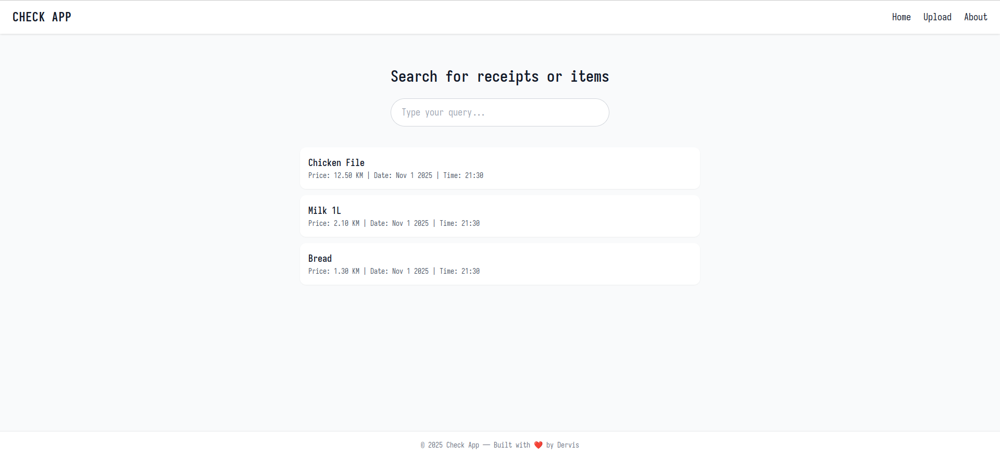

# Check Application 💰

Track your expenses in a snap! Just snap a receipt, upload it, and let **Check** do the rest.

## version 0.1



## How it works
1. Go to the store and buy what you need.  
2. Take a picture of your receipt.  
3. Upload it to the app.  

The app will automatically extract and organize your expenses for you.  

## Future Plans
In upcoming releases, the app will include a **history feature**, allowing users to:  
- See the **maximum** and **minimum** prices of selected items over time.  

Stay tuned for more features that make managing your expenses even easier!  

## Tech Stack
- Language: *JavaScript, Golang*  
- OCR (Optical Character Recognition) / Image Processing: *Veryfi*  
- Database: *PostgreSQL*  

## How to Run
1. Clone the repository:  
   ```bash
   git clone https://github.com/derva/check
2. Get your credentials from **Veryfi**
3. Insert Verify and Database credentials to the _*.env*_ file
4. Build and run (go build main.go; ./main)
